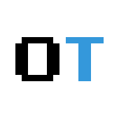

  

Este repositorio contiene la página web pública de [OpenTech](https://opentech.pe), la comunidad de usuarios amantes de la tecnología en Tingo María, Perú :peru: .

> [!NOTE]
> Nos juntamos una vez al mes, de 7:00 pm a 9:00 pm para escuchar charlas sobre tecnologías y temas relacionados. Estas reuniones son libres y gratuitas. No se requiere invitación o nivel de conocimiento.

Los canales oficiales para ponerte en contacto son:

- [GitHub](https://github.com/opentech-pe)
- [Correo](hola@opentech.pe)

## :earth_americas: Comunidad de Tecnología

Como a tí, nos encanta la tecnología y hablar de ella, puedes seguir los eventos de la comunidad en Facebook.

[Siguenos en Facebook](https://facebook.com/OpenTechTM)

## :nerd_face: Espacio Libre y Abierto

Somos una comunidad con ganas de aprender siempre abierta a nuevas propuestas de charlas. Si hay algo en lo que eres experto o estas aprendiendo, la mejor forma de aprender es enseñar.

[Propón una charla](https://github.com/opentech-pe/opentech.pe/issues/new?assignees=jimmyloloy98%2C+juancx21&labels=cfp&template=propuesta-de-charla.md&title=T%C3%ADtulo+de+tu+charla)

_NOTA: Si necesitas ayuda con este proceso porque eres nuevo con GitHub o git, tambien puedes contactarnos por correo. Nos encanta ayudar_ :wink:

### :gem: Sponsors

¿Quieres que tu empresa u organización patrocine los eventos de la comunidad?

[Auspiciar en Github](https://github.com/sponsors/opentech-pe)

## :scroll: Código de conducta

Nuestros eventos se rigen por el siguiente [Código de conducta](/CODE_OF_CONDUCT.md)

## ✨ Contributors

Gracias a estas increibles personas:

<!-- ALL-CONTRIBUTORS-LIST:START - Do not remove or modify this section -->
<!-- prettier-ignore-start -->
<!-- markdownlint-disable -->
<table>
  <tr>
    <td align="center"><a href="https://github.com/paulotijero"> <b>Paulo Tijero</b></a> <a href="https://github.com/opentech-pe/opentech.pe/commits?author=paulotijero" title="Code">💻</a> <a href="#projectManagement-paulotijero" title="Project Management">📆</a></td>
    <td align="center"><a href="https://juancxh.com/"> <b>Juan Campos</b></a> <a href="https://github.com/opentech-pe/opentech.pe/commits?author=Juancxh" title="Code">💻</a></td>
    <td align="center"><a href="https://github.com/jimmyloloy98"> <b>Jimmy Loloy</b></a> <a href="https://github.com/opentech-pe/opentech.pe/commits?author=JimmyLoloy98" title="Code">💻</a></td>
    <td align="center"><a href="https://github.com/DayanaHorna28"> <b>Dayana Horna</b></a> <a href="https://github.com/opentech-pe/opentech.pe/commits?author=DayanaHorna28" title="Code">💻</a></td>
  </tr>
  </tr>
</table>

<!-- markdownlint-enable -->
<!-- prettier-ignore-end -->
<!-- ALL-CONTRIBUTORS-LIST:END -->

Este proyecto sigue la especificación de [all-contributors](https://github.com/all-contributors/all-contributors). ¡Todo tipo de contribuciones son bienvenidas!
